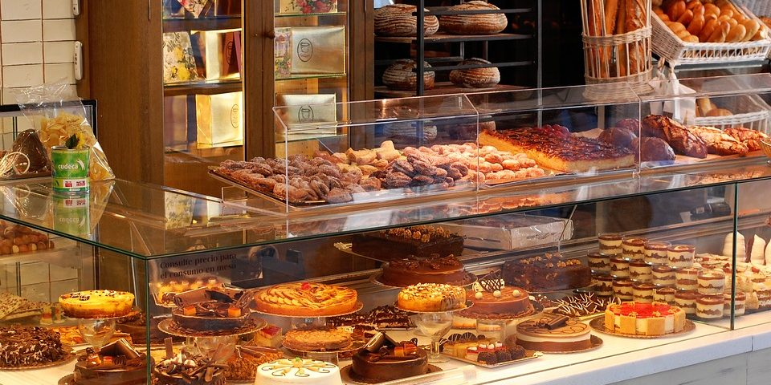

# 🍞 Projeto Final — Padoca da Gigi (Front-End)

Este repositório apresenta o **projeto final de Front-End** desenvolvido durante o **1º semestre do 1º ano** do curso de **Sistemas de Informação**.  
O site foi criado com o tema **Padoca da Gigi**, uma padaria virtual desenvolvida em **HTML e CSS**, com foco em organização visual, cores convidativas e navegação simples e intuitiva.

---

## 🗓️ Informações do Projeto

- **Período:** 1º semestre do 1º ano (2024)  
- **Disciplina:** Desenvolvimento Web / Front-End  
- **Instituição:** Faculdade de Sistemas de Informação  
- **Tema:** Padaria Virtual — *Padoca da Gigi*  

---

## 🎯 Objetivos

- Criar um site temático utilizando **HTML e CSS puro**  
- Aplicar conceitos de **semântica, hierarquia visual e design responsivo**  
- Desenvolver uma interface agradável, simulando o ambiente de uma padaria moderna  
- Praticar boas práticas de **estruturação de páginas web** e **organização de arquivos**

---

## 📚 Estrutura do Projeto

```
Padoca_da_Gigi/
│
├── index.html                # Página inicial
├── produtos.html             # Página com os produtos da padaria
├── bebidas.html              # Página com as bebidas disponíveis
├── favoritos.html            # Página de favoritos
├── solicitacao.html          # Página de solicitações ou pedidos
│
├── assets/
│   ├── css/
│   │   ├── style.css         # Estilo principal do site
│   │   └── bebidas_style.css # Estilo adicional para a página de bebidas
│   │
│   └── images/               # Imagens dos produtos, logo e layout
│
└── README.md                 # Documentação do projeto
```

---

## 💻 Tecnologias Utilizadas

- **HTML5** — Estrutura das páginas  
- **CSS3** — Estilização e layout responsivo  

---

## 🧠 Funcionalidades e Destaques

- Navegação entre páginas totalmente em **HTML e CSS**  
- Design visual voltado para o público de **padarias e cafés**  
- Seções organizadas: produtos, bebidas, favoritos e solicitações  
- Imagens reais de produtos para criar uma experiência imersiva  

---

## 🚀 Como Visualizar o Projeto

1. Baixe ou clone este repositório:
   ```bash
   git clone https://github.com/seu-usuario/padoca-da-gigi.git
   ```

2. Acesse a pasta do projeto:
   ```bash
   cd Padoca_da_Gigi
   ```

3. Abra o arquivo `index.html` no navegador de sua preferência.

> 💡 Dica: use a extensão **Live Server** no VS Code para navegar entre as páginas facilmente.

---

## 📸 Resultado Visual (opcional)

Você pode incluir aqui capturas de tela, por exemplo:

```


```

---

## 👩‍💻 Desenvolvido por

**Geovana Bicalho**  
Estudante de Sistemas de Informação — 1º Ano, 1º Semestre  
📅 Projeto Final de Front-End — 2024

---
